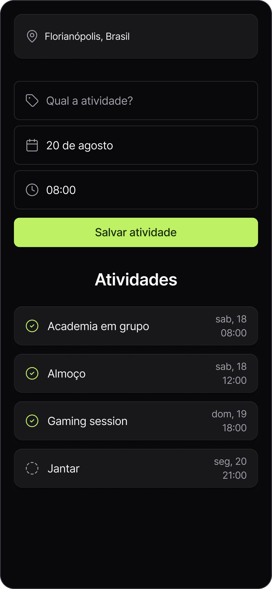
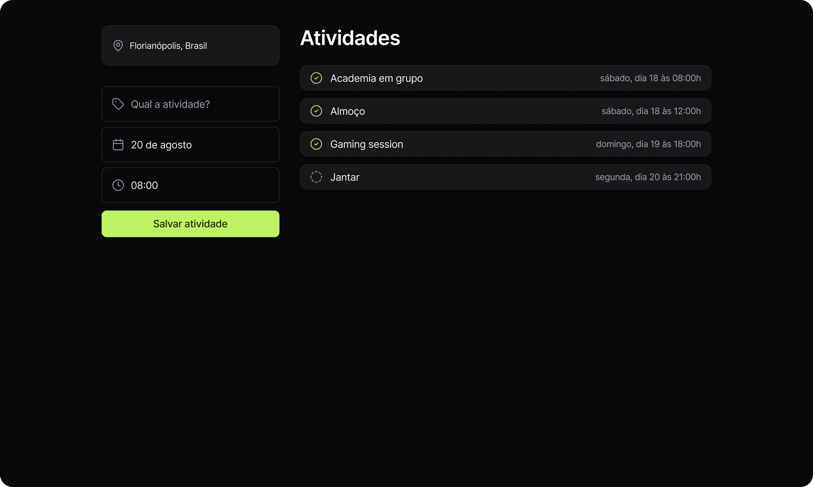

<h1 align="center">
  <a href="https://nlw-journey-trilha-html-css-js.vercel.app">
    
  </a>
</h1>

## 📃 Roteiro

<ul>
  <li>
    <a href="#versao-mobile">
      📱 Versão Mobile
    </a>
  </li>
  <li>
    <a href="#versao-desktop">
      🖥️ Versão Desktop
    </a>
  </li>
  <li>
    <a href="#sobre">
      ❓ Sobre
    </a>
  </li>
  <li>
    <a href="#tecnologias">
      🛠️ Tecnologias
    </a>
  </li>
  <li>
    <a href="#pre-requisitos">
      📋 Pré-requisitos
    </a>
  </li>
  <li>
    <a href="#instalacao">
      🔧 Instalação
    </a>
  </li>
  <li>
    <a href="#executando">
      ⚙️ Executando
    </a>
  </li>
  <li>
    <a href="#layout">
      🔖 Layout
    </a>
  </li>
  <li>
    <a href="#deploy">
      🌐 Deploy
    </a>
  </li>
  <li>
    <a href="#autor">
      🧑‍💻 Autor
    </a>
  </li>
  <li>
    <a href="#Licença">
      📝 Licença
    </a>
  </li>
</ul>

## 📱 Versão Mobile

<p align="center">
  <a href="https://nlw-journey-trilha-react.vercel.app">
    
  </a>
</p>

## 🖥️ Versão Desktop

<p align="center">
  <a href="https://nlw-journey-trilha-react.vercel.app">
    
  </a>
</p>

## ❓ Sobre

<p align="justify">
  
</p>

## 🛠️ Tecnologias

O projeto foi desenvolvido com as seguintes tecnologias:

- [HTML](https://developer.mozilla.org/pt-BR/docs/Web/HTML)
- [CSS](https://developer.mozilla.org/pt-BR/docs/Web/CSS)
- [JavaScript](https://developer.mozilla.org/pt-BR/docs/Web/JavaScript)
- [Day.js](https://day.js.org)

## 📋 Pré-requisitos

Verifique aos seguintes pré-requisitos para poder instalar e executar o projeto:

1. Ter instalado um editor de código: [VS Code](https://code.visualstudio.com/download)
2. Ter instalado o [Git](https://git-scm.com/downloads)
3. Ter instalado a extensão [Live Server](https://marketplace.visualstudio.com/items?itemName=ritwickdey.LiveServer)

## 🔧 Instalação

Siga o passo a passo para instalar o projeto:

1. Abra o terminal e clone o repositório do projeto:

```bash
git clone https://github.com/pedroeuzebiooo/nlw-journey-trilha-html-css-js
```

## ⚙️ Executando

Siga o passo a passo para executar o projeto:

1. Entre na pasta do projeto clonado:

```bash
cd nlw-journey-trilha-html-css-js
```

2. Abra a pasta do projeto clonado no editor de código de sua preferência. Caso seja o [VS Code](https://code.visualstudio.com/download) digite o comando:

```bash
code .
```

3. Abra o arquivo `index.html` com a extensão [Live Server](https://marketplace.visualstudio.com/items?itemName=ritwickdey.LiveServer) do VS Code

## 🔖 Layout

Visualize o layout do projeto através <a href="https://www.figma.com/community/file/1392277205162897872">DESSE LINK</a>. É necessário ter conta no <a href="https://figma.com">Figma</a> para acessá-lo.

## 🌐 Deploy

- [Exibir projeto](https://nlw-journey-trilha-html-css-js.vercel.app)

## 🧑‍💻 Autor

<table>
  <tr>
    <td align="center">
      <a href="https://github.com/pedroeuzebiooo">
        
        <br />
        Pedro Euzebio
      </a>
    </td>
  </tr>
</table>

## 📝 Licença

O projeto está sob licença MIT. Veja o arquivo [LICENSE](./LICENSE) para mais detalhes.
